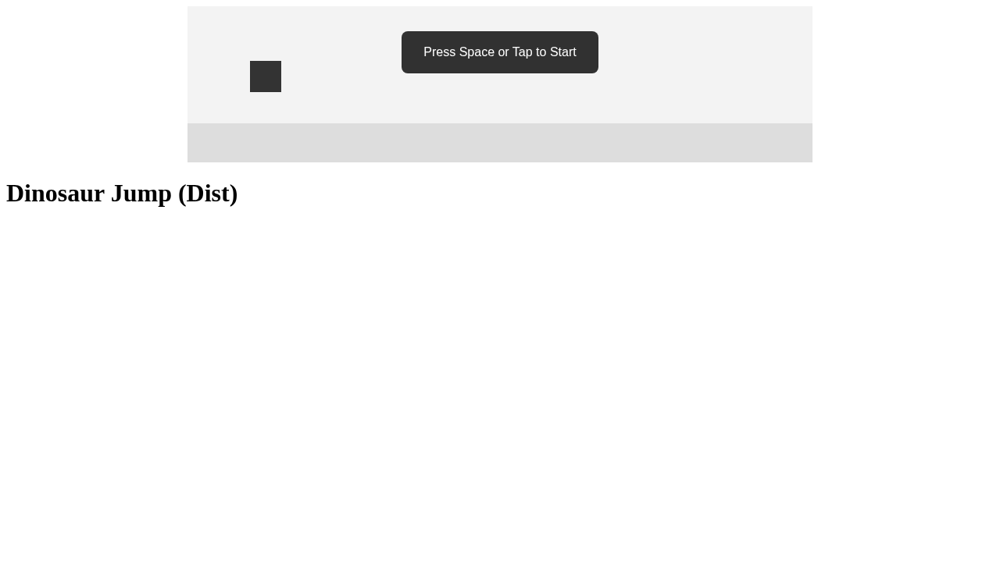

# Codex Game Lab: Dinosaur Jump Integration Demo

This is an end-to-end Codex-in-container integration run against the repo-local LiteLLM stack.

## Goal

Demonstrate that a developer can:

1. Run Codex in an isolated container.
2. Reach only the local LiteLLM proxy.
3. Build a staged game prototype from prompt series.
4. Capture real Codex usage tokens for reporting/costing.

## Safety Verification

Verified before running stage prompts:

1. Private network is internal-only:
   - `docker network inspect codex-game-lab_llm_internal --format '{{json .Internal}} {{json .Name}} {{len .Containers}}'`
   - Result: `true "codex-game-lab_llm_internal" 1`
2. Codex can reach LiteLLM:
   - `docker compose run --rm --no-deps codex sh -lc "curl -sS http://litellm:4000/health/liveliness"`
   - Result: `"I'm alive!"`
3. Codex cannot reach public internet:
   - `docker compose run --rm --no-deps codex sh -lc "curl -I -m 8 https://example.com || true"`
   - Result: `Could not resolve host: example.com`
4. Sandbox file access is workspace-limited:
   - Log: `demo/dinosaur-jump-run/logs/00-safety-filecheck.jsonl`
   - Result in log: write to `/workspace/.sandbox_probe_ok` succeeds; write to `/etc/codex_probe_forbidden` fails with `Permission denied`.

## Prompt Series Used (Exact Order)

1. `demo/dinosaur-jump-run/prompts/01-creation-used.md`
2. `demo/dinosaur-jump-run/prompts/02-balance-used.md`
3. `demo/dinosaur-jump-run/prompts/03-polish-used.md`

Base prompt sources copied for traceability:

- `demo/dinosaur-jump-run/prompts/01-creation-base.md`
- `demo/dinosaur-jump-run/prompts/02-balance-base.md`
- `demo/dinosaur-jump-run/prompts/03-polish-base.md`

## Evolution Screenshots

### Creation


### Balance


### Polish



## Outputs

Each stage has its own isolated artifact folder:

- `demo/dinosaur-jump-run/creation`
- `demo/dinosaur-jump-run/balance`
- `demo/dinosaur-jump-run/polish`

Each stage includes:

- `game/` prototype code
- `tests/` validation files
- `progress.md` implementation log

## Codex Usage and Cost

- Consolidated report: `demo/dinosaur-jump-run/REPORT.md`
- Raw Codex JSON logs:
  - `demo/dinosaur-jump-run/logs/01-creation.jsonl`
  - `demo/dinosaur-jump-run/logs/02-balance.jsonl`
  - `demo/dinosaur-jump-run/logs/03-polish.jsonl`

Usage values come from `turn.completed.usage` in those logs.

## Quick Validation Run

Node-only tests were run inside the Codex container:

```bash
docker compose run --rm --no-deps codex sh -lc 'set -e; for s in creation balance polish; do echo "== $s =="; cd /workspace/demo/dinosaur-jump-run/$s; node tests/node_tests.js; cd - >/dev/null; done'
```

All three stages returned `ALL OK`.

## Evaluation: Did It Actually Do Anything?

Yes. This run produced a working, deterministic Dino prototype and a meaningful staged evolution:

1. Stage 1 (`creation`) built the playable core:
   - score increases with simulated time
   - collision flips `game_over`
   - deterministic hooks exist and are testable
2. Stage 2 (`balance`) added a real difficulty curve:
   - explicit `easy -> medium -> hard` phases
   - per-phase obstacle speed/spawn tuning
   - deterministic phase checks in tests
3. Stage 3 (`polish`) added visible UX features in browser runtime:
   - start + game-over overlays with restart
   - keyboard + touch jump input
   - squash/stretch and dust effects

### Did It Do Anything Smart?

Yes, two choices were notably smart for this environment:

1. It protected deterministic tests by gating visual DOM code in polish when no DOM exists (`if (typeof document === "undefined") return;` in `game/dist/main.js`), so node-based deterministic tests still pass.
2. It preserved hook compatibility by mutating the existing `window.__GAME` object on restart instead of replacing it, so `advanceTime`/`render_game_to_text` references stay valid.

### What It Missed / Quality Gaps

1. Stage 3 claims “subtle collision shake,” but no shake behavior is present in `polish/game/dist/main.js`.
2. Stage 3 prompt asked for overlay/restart Playwright coverage; current `polish/tests/playwright.spec.ts` still only checks score/phase/collision.
3. Polish changes were appended directly to `game/dist/main.js`, while `game/src/main.ts` stayed unchanged from balance. This is functional but not maintainable/rebuild-safe.

## Re-run This Demo

```bash
docker compose up -d litellm

docker compose run --rm --no-deps codex codex exec --full-auto --json \
  -C /workspace/demo/dinosaur-jump-run/creation \
  -c model_provider='"'"'local_litellm'"'"' \
  -c model='"'"'gpt-5-nano'"'"' \
  -c 'model_providers.local_litellm={name="Codex Game Lab LiteLLM",base_url="http://litellm:4000/v1",env_key="CUSTOM_LLM_API_KEY"}' \
  - < /workspace/demo/dinosaur-jump-run/prompts/01-creation-used.md \
  > /workspace/demo/dinosaur-jump-run/logs/01-creation.jsonl
```

Repeat for `02-balance-used.md` and `03-polish-used.md` with matching output log names.
