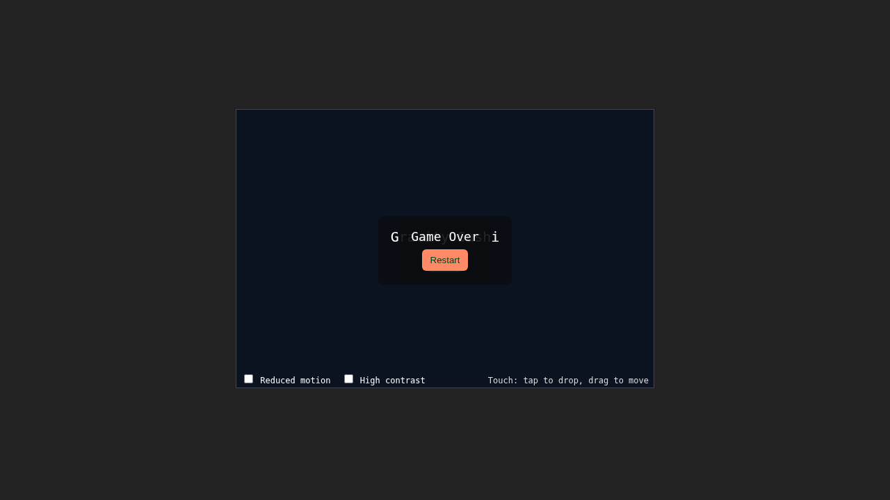

# Codex Game Lab: Gravity Sushi Integration Demo (Try Again Pass)

This is a full staged integration run of Gravity Sushi through Codex-in-container against repo-local LiteLLM.

## Run Output

Stages were executed in order:

1. `demo/gravity-sushi-run/creation`
2. `demo/gravity-sushi-run/balance`
3. `demo/gravity-sushi-run/polish`

Each stage contains:

- `game/src/*`
- `game/tests/playwright.spec.ts`
- `game/progress.md`

## Prompt Order Used

1. `demo/gravity-sushi-run/prompts/01-core-used.md`
2. `demo/gravity-sushi-run/prompts/02-balance-used.md`
3. `demo/gravity-sushi-run/prompts/03-polish-used.md`

Base copies are included for traceability:

- `01-core-base.md`
- `02-balance-base.md`
- `03-polish-base.md`

## Evolution Screenshots

### Creation

### Balance

### Polish

## Notes On This "Try Again"

- `core` completed after one aborted attempt (`logs/01-core-attempt1.jsonl`) and one successful pass (`logs/01-core.jsonl`).
- `balance` completed with a long/tool-noisy run, but produced a valid staged artifact and usage record.
- `polish` required a non-TTY rerun to reach a clean `turn.completed`; final successful log is `logs/03-polish.jsonl`.
- All final stage logs (`01-core.jsonl`, `02-balance.jsonl`, `03-polish.jsonl`) contain `turn.completed` usage.

## Usage + Cost

- Consolidated usage/cost report: `demo/gravity-sushi-run/REPORT.md`
- Raw logs:
  - `demo/gravity-sushi-run/logs/01-core.jsonl`
  - `demo/gravity-sushi-run/logs/02-balance.jsonl`
  - `demo/gravity-sushi-run/logs/03-polish.jsonl`

## Quick Observations

- The staged flow is reproducible with deterministic hooks (`advanceTime`, `render_game_to_text`, seeded drop control).
- Most token overhead came from repeated file reads and retries in `balance`/`polish`, not from code volume.
- The final polish stage added overlays, touch input, and accessibility toggles while keeping core game loop behavior.
